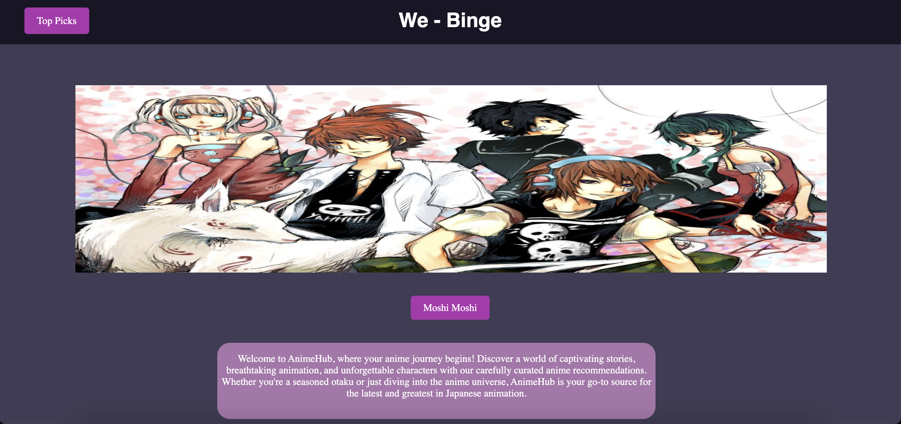

# Wee-Binge

Welcome to Wee-Binge - Your Anime Hub

## Description

Wee-Binge is a feature-rich web application that serves as your gateway to the world of anime. Discover captivating stories, breathtaking animation, and unforgettable characters with our carefully curated anime recommendations. Whether you're a seasoned otaku or just diving into the anime universe, AnimeHub is your go-to source for the latest and greatest in Japanese animation.

## Features

- **Top Picks**: Explore the top anime picks with just a click.
- **Automatic Carousel**: Enjoy a dynamic carousel of anime images on the main page.
- **Anime Recommendations**: Get personalized anime recommendations based on your preferences.
- **Search Functionality**: Easily search for your favorite anime titles.
- **Responsive Design**: The application is designed to work seamlessly on various devices.

## Technologies Used

- HTML5
- CSS3
- JavaScript

## Setup

1. Clone the repository.
2. Open the `mainpage.html` file in your preferred web browser.

## Usage

- Click on "Top Picks" to explore recommended anime.
- Use the search bar to find specific anime titles.
- Enjoy the carousel of anime images on the main page.

## Screenshots

## Further Scope

### Machine Learning for Top Picks

In the future, we plan to enhance the "Top Picks" feature by implementing machine learning algorithms. This will allow us to provide users with more accurate and personalized anime recommendations based on their viewing history, preferences, and trends within the anime community.

### Deployment with Heroku/Docker

To ensure smooth deployment and scalability, we aim to deploy Wee-Binge using cloud platforms like Heroku. Additionally, we'll implement Docker containers to encapsulate the application and its dependencies, making deployment and scaling more efficient.

### Client-Server Architecture using MERN Stack

We are working towards developing a robust client-server architecture using the MERN (MongoDB, Express.js, React.js, Node.js) stack. This will provide a scalable and maintainable structure for the application, enabling seamless communication between the client-side and server-side components.

## Credits

- Aryan Jain
- Abhishek Jha
- Aarav Amawate
- Angadjeet Singh
